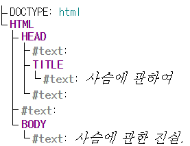

# [DOM 트리](https://ko.javascript.info/dom-nodes)

Q. DOM 트리가 무엇인가요?

> DOM 트리는 HTML / XML 문서를 브라우저가 읽을 수 있도록 변환된 문서 객체 모델입니다. HTML의 각 태그들은 각각의 객체로 표현되어지며, 이 객체들은 계층이 있는 트리의 형태로 구조화되어 있기 때문에 DOM 트리라고 합니다. 자바스크립트로 이 객체들에 접근하여 조작할 수 있습니다.

Q. DOM 트리는 무엇으로 구성되어있나요?

> DOM 트리는 노드들로 구성됩니다. 노드의 종류는 총 12개이며, 실무에서는 주로 4가지 노드를 다룹니다.

- 문서 노드 (Document Node)
  - DOM 트리의 시작점이 되는, 트리의 최상위에 위치하는 노드입니다.
  - 시작점이기때문에 이 문서 노드를 통해서 다른 하위 노드들에 접근할 수 있습니다.
- 요소 노드 (Element Node)
  - HTML 태그(요소)로 만들어지는 노드입니다.
- 텍스트 노드 (Text Node)
  - HTML 태그 내의 텍스트를 나타내는 노드입니다.
  - 텍스트 노드는 문자열만 담고 있습니다.
  - 자식 노드를 가질 수 없으며, 트리의 잎 노드입니다.
- 주석 노드 (Comment Node)
  - 주석을 나타내는 노드입니다.
  - DOM 트리에만 나타날 뿐 실제 화면에는 나타나지 않습니다.

```html
<!DOCTYPE html>
<html>
  <head>
    <title>사슴에 관하여</title>
  </head>
  <body>
    사슴에 관한 진실.
  </body>
</html>
```

> 위의 HTML은 아래와 같은 트리구조로 변환됩니다.



Q. 비어있는 텍스트 노드는 무엇인가요?

> 새 줄(newline)과 공백(space)입니다. DOM 트리에는 새 줄과 공백도 표시됩니다. 첫 번째 빈 텍스트 노드는 `head`태그와 `title`태그 사이의 새 줄과 `title`태그 앞의 공백을 담고 있습니다.

> 하지만 개발자 도구에는 이러한 공백만 있는 텍스트 노드를 나타내지 않습니다. 또한 텍스트 노드 생성에는 2가지 예외가 있습니다.
>
> 1. `<head>`이전의 공백과 새 줄은 무시됩니다.
> 2. `</body>` 뒤에는 공백이 있을 수 없습니다. `</body>` 뒤에 어떤 것을 작성하더라도 자동으로 `body`의 안쪽으로 이동되기 때문입니다.

Q. 만약 닫는 태그가 없는 것과 같은 경우는 어떻게 되나요?

> 브라우저가 DOM 생성과정에서 자동으로 교정합니다. 만약 가장 최상위 태그가 `<html>`태그여야 하는데 없다면, 알아서 최상위에 넣어줍니다. 또한 `<li>`태그가 있는데 `</li>`태그가 없는 경우에도 알아서 빠진 부분을 넣어줍니다. 만약 `<table>`태그를 사용할 때 `<tbody>`가 없는 경우에도 알아서 만들어 넣어줍니다.

Q. DOM 트리는 어떻게 볼 수 있나요?

- [Live DOM Viewer](http://software.hixie.ch/utilities/js/live-dom-viewer/)
  - HTML문서를 입력하면 DOM 구조를 보여줍니다.
- 브라우저의 개발자 도구
  - Elements 패널에서 DOM 트리를 볼 수 있습니다.
  - 또한 Console 패널을 사용하여 DOM을 조작할 수도 있습니다.
    - Elements 패널에서 특정 요소를 클릭합니다. → Console 패널에서 가장 마지막에 클릭했던 요소에 대해 `$0`으로 접근합니다.
    - 만약 `$0.style.background = 'red’` 을 입력한다면 가장 마지막에 클릭했던 요소의 배경색이 빨간색으로 표시되는 것을 볼 수 있습니다.
