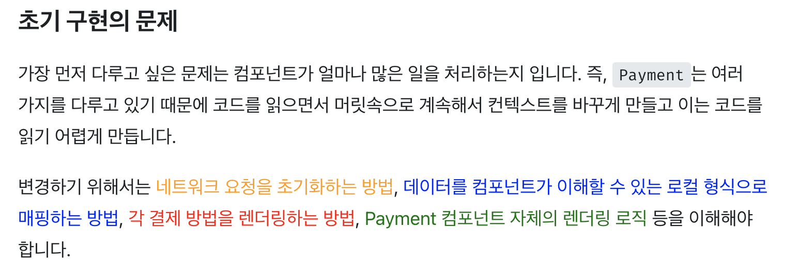

# [번역] 잘 알려진 UI 패턴을 사용하여 리액트 애플리케이션 모듈화하기

## (what) 어떤 내용이 나왔나요?

> 2023.03.18(토) 숙제
>
> 1. 아래 질문에 대한 답변을 모두 찾아옵니다.
> 2. 아래 질문을 제외하고 이 아티클에서 정확히 이해하지 못한 단어, 문장, 내용을 모두 적습니다.

Q. 비즈니스 로직이란 무엇인가요?

- 데이터를 가져오고 재구성하는 로직으로 UI와 관련된 정보는 포함하지 않는 로직입니다.

Q. 뷰 로직과 뷰가 아닌 로직은 어떻게 구분하나요?

- UI를 그리는 로직이 뷰 로직입니다.

Q. 리액트에서 뷰 로직과 뷰가 아닌 로직을 분리하는 방법은 무엇인가요?

- 첫번째 방법은 뷰가 아닌 로직을 커스텀 훅으로 분리하여 뷰 로직과 분리할 수 있습니다. 두번째 방법은 뷰 로직을 하위 컴포넌트로 추출하여 분리할 수 있습니다. 세번째 방법은 데이터와 동작을 클래스로 추출하여 분리할 수 있습니다.

Q. 아래 문장에서 색깔별로 해당하는 코드가 무엇인가요?



```tsx
export const Payment = ({ amount }: { amount: number }) => {
  const [paymentMethods, setPaymentMethods] = useState<LocalPaymentMethod[]>(
    []
  );

  useEffect(() => {
    const fetchPaymentMethods = async () => {
      /* START: 네트워크 요청을 초기화하는 방법 */
      const url = "https://online-ordering.com/api/payment-methods";

      const response = await fetch(url);
      const methods: RemotePaymentMethod[] = await response.json();
      /* END */

      if (methods.length > 0) {
        /* START: 데이터를 컴포넌트가 이해할 수 있는 로컬 형식으로 매핑하는 방법 */
        const extended: LocalPaymentMethod[] = methods.map((method) => ({
          provider: method.name,
          label: `Pay with ${method.name}`,
        }));
        /* END */
        extended.push({ provider: "cash", label: "Pay in cash" });
        setPaymentMethods(extended);
      } else {
        setPaymentMethods([]);
      }
    };

    fetchPaymentMethods();
  }, []);

  /* START: Payment 컴포넌트 자체의 렌더링 로직 */
  return (
    <div>
      <h3>Payment</h3>
      <div>
        /* START: 각 결제 방법을 렌더링하는 방법 */
        {paymentMethods.map((method) => (
          <label key={method.provider}>
            <input
              type="radio"
              name="payment"
              value={method.provider}
              defaultChecked={method.provider === "cash"}
            />
            <span>{method.label}</span>
          </label>
        ))}
        /* END */
      </div>
      <button>${amount}</button>
    </div>
  );
  /* END */
};
```

## 2023.04.01.next

서버 데이터에서 준 결제 방법에 따라 다른 방식으로 UI를 렌더링하는 부분을 새로운 컴포넌트로 추출할 수 있어. 어떻게 추출할 수 있는데?

paymentMethods를 map으로 돌리는 부분을 PaymentMethods컴포넌트로 추출하면 돼. 왜 그렇게 따로 추출하는데? 하면 뭐가 좋아?

이렇게 따로 분리하면 PaymentMethods컴포넌트는 순수함수라서 다른 곳에서 재사용하기 쉬워져서 좋아. 또 Payment컴포넌트도 결제 방법이 아닌 제목과 버튼을 렌더링하는 일에만 집중할 수 있어.

PaymentMethods컴포넌트에서 defaultChecked되어야 하는지 직접 체크하는 로직이 있는데 이 부분도 개선할 수 있어. 왜 개선해야돼? 뭐가 문제야 대체.. (이제 그만해..)

데이터 객체의 속성을 직접 확인하는 로직이 한 곳에 뭉쳐져있는게 아니라 여러 곳에 흩어져있게 되면 수정하기 어려워지기 때문이야. 클래스로 만들어서 관리하게 되면 코드의 변화가 생겨서 수정해야할 때 그 클래스 파일에서 수정하면 되니까 유지보수하기 편해져.

또 usePaymentMethods 훅에서 서버 데이터를 로컬 데이터로 변환하는 부분도 위에서 말한 부분과 함께 클래스로 묶어서 만들 수 있어. 여긴 또 왜..?

왜냐면..훅 내부에서 데이터 객체의 속성에 직접 접근해서 데이터 형태를 변환하고 있기 때문이야.

그래서 PaymentMethod 도메인 클래스를 만들어서 도메인 객체를 관리함으로서 도메인 데이터 관련 로직을 분리할 수 있어. 데이터 속성에 직접 접근해서 확인하는 일이 더 이상 PaymentMethods 컴포넌트의 관심사가 아닌 도메인 객체의 관심사로 분리됐어. usePaymentMethods 훅도 더이상 데이터를 변환하는 로직이 자신이 관심사가 아닌 도메인 객체의 관심사로 분리됐어. 이렇게 분리하면 만약 서버 데이터의 key나 value가 바뀌었을 때 PaymentMethod 클래스에서만 수정하면 되기 때문에 유지보수에 용이해지는 장점이 있어.

## 📚 함께 읽기

- [velog - [번역] 잘 알려진 UI 패턴을 사용하여 리액트 애플리케이션 모듈화하기](https://velog.io/@eunbinn/modularizing-react-apps#%EC%83%88%EB%A1%9C%EC%9A%B4-%EA%B5%AC%EC%A1%B0%EC%9D%98-%EC%9D%B4%EC%A0%90%EB%93%A4)
